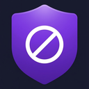

  

<h1 align="center">ShadowBlock</h1>

  <strong>The ad blocker that will never sell you out.</strong>

  119,000+ filter rules. Zero data collected. No acceptable ads. No sellout.

---

## What is ShadowBlock?

ShadowBlock is a Chrome ad blocker built natively on Manifest V3 — not a port. It blocks ads, trackers, and annoyances across the web without collecting a single byte of your data.

## Why ShadowBlock?

Every major ad blocker has either sold out or been killed:

- **Adblock Plus / AdBlock** make $63M/year letting Acceptable Ads through. A NYU study proved this exposes users to **13.6% more problematic ads** than using no blocker at all.
- **uBlock Origin** was removed from the Chrome Web Store when Google killed MV2 support.
- **uBlock Origin Lite** ships only ~17,000 rules with no custom filters, no element picker, and weak anti-adblock bypass.
- **Total Adblock** paid a $2.5M class-action settlement over scammy auto-renewals.

ShadowBlock exists because Chrome users deserve an ad blocker that actually works AND does not betray their trust.

## Features

- **119,000+ filter rules** — 7x more than uBlock Origin Lite
- **Anti-adblock bypass** — works on Forbes, Wired, Fandom, and 20+ sites that block other ad blockers
- **YouTube ad blocking** — skips pre-roll, mid-roll, overlay ads, and Premium upsell prompts
- **37 scriptlets** — full scriptlet injection engine matching uBlock Origin / AdGuard capabilities
- **16 surrogate scripts** — Google IMA, AdSense, Analytics, GTM, and more replaced with safe stubs
- **Cosmetic filtering** — hides ad containers, sponsored content, and recommendation spam
- **Element picker** — right-click any element to block it
- **Custom rules** — write your own blocking rules
- **Auto-updating filter lists** — 4,900 dynamic rules refreshed every 24 hours
- **Zero data collection** — no telemetry, no analytics, no network requests to our servers

## How We Compare

| Feature | ShadowBlock | uBO Lite | AdGuard | Adblock Plus |
|---------|:-----------:|:--------:|:-------:|:------------:|
| Filter rules | **119,000+** | ~17,000 | Large | Medium |
| Custom rules | Yes | No | Yes* | Yes |
| Element picker | Yes | No | Yes | Yes |
| Anti-adblock bypass | **20+ sites** | Weak | Strong** | Moderate |
| Scriptlet engine | **37 scriptlets** | Limited | Full | Small |
| Surrogate scripts | **16 stubs** | No | Yes | Yes |
| YouTube blocking | Yes | Weak | Strong | Basic |
| Acceptable Ads | **Never** | No | No | **Yes (default)** |
| Data collection | **None** | None | None | Tracking for AA |
| Price | **Free** | Free | Free*** | Free/$4mo |

\* Requires Chrome Developer mode in MV3
\** Requires separate AdGuard Extra extension
\*** Desktop app is $2.49/mo

## Our Promise

**We will never:**

1. Take money from advertisers to whitelist their ads
2. Collect, store, or sell your browsing data
3. Ship a crippled free version to push you to premium
4. Use dark patterns, countdown timers, or deceptive opt-outs
5. Bundle toolbars, search engine changes, or antivirus upsells

ShadowBlock makes money from optional premium features — never from advertisers paying to get unblocked.

## Install

**Chrome Web Store:** *(Coming soon — currently in review)*

**Manual install (Developer mode):**
1. Download or clone this repo
2. Open chrome://extensions
3. Enable Developer mode
4. Click Load unpacked and select this folder

## Privacy

ShadowBlock makes zero network requests for telemetry. All filter lists are bundled with the extension. Your browsing data never leaves your device.

[Full Privacy Policy](https://ogkingallan.github.io/shadowblock-privacy/)

## Tech Stack

- **Architecture:** Chrome Manifest V3 (native, not ported from MV2)
- **Ad blocking:** declarativeNetRequest API with 119,000+ static rules + 4,900 dynamic rules
- **Content filtering:** Cosmetic CSS injection, MutationObserver, scriptlet engine
- **Anti-adblock:** Domain-specific scriptlets injected at document_start
- **Surrogates:** 16 redirect resources replacing blocked ad scripts with safe stubs
- **YouTube:** Dedicated content script with JSON pruning, fetch/XHR interception, and DOM mutation observer

## License

All rights reserved. This code is provided for review and transparency purposes.

---

  Built by a solo dev who got tired of ad blockers selling out.

